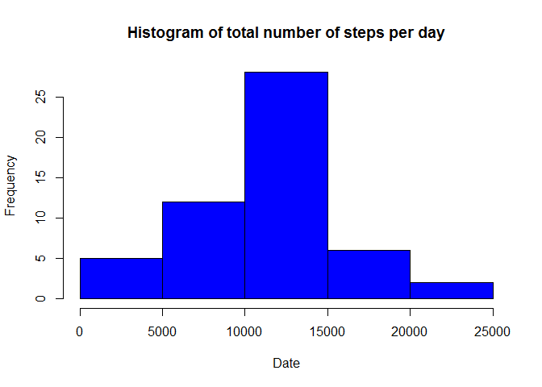
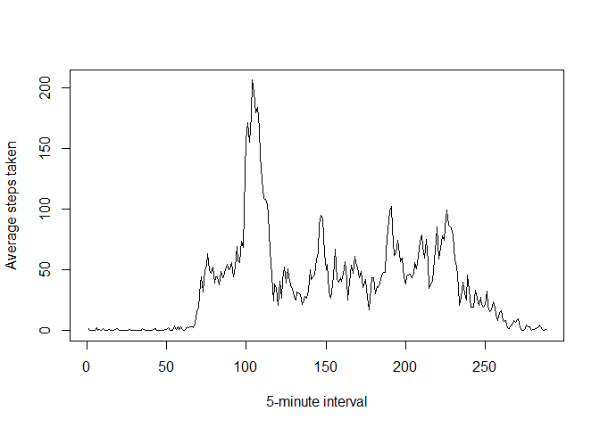
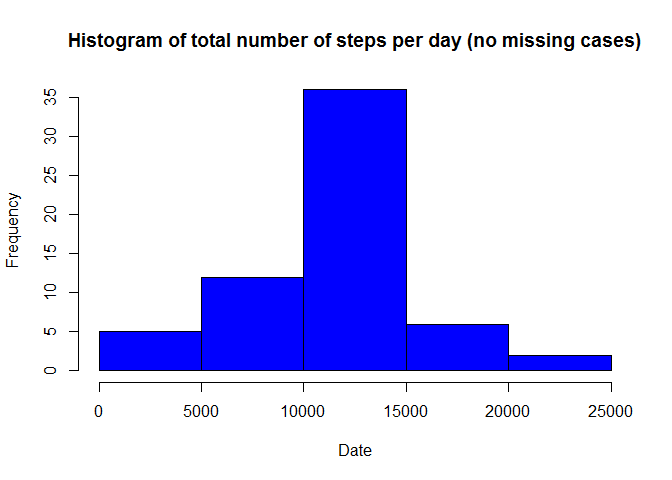

# Reproducible Research: Peer Assessment 1
JE-  
November 16, 2014  


## Loading and preprocessing the data

```r
unzip("activity.zip")
data <- read.csv("activity.csv",colClasses = c("integer", "Date", "integer"))
```

## What is mean total number of steps taken per day?

- Make a histogram of the total number of steps taken each day

```r
totalSteps <- tapply(data$steps,data$date,sum)
hist(totalSteps, main="Histogram of total number of steps per day", 
    xlab="Date",col=c("blue"))
```

 

- Calculate and report the mean and median total number of steps taken per day

```r
meanSteps <- mean(totalSteps,na.rm=T)
medianSteps <- median(totalSteps,na.rm=T)
meanSteps
```

```
## [1] 10766
```

```r
medianSteps
```

```
## [1] 10765
```
The mean total number of steps taken per day is 1.0766 &times; 10<sup>4</sup>, and the median total number of steps taken per day is 10765.

## What is the average daily activity pattern?
- Make a time series plot (i.e. type = "l") of the 5-minute interval (x-axis) and the average number of steps taken, averaged across all days (y-axis)


```r
stepsByInterval<-tapply(data$steps,data$interval,mean,na.rm=T)
plot(stepsByInterval,type = 'l',xlab = "5-minute interval", ylab = "Average steps taken")
```

 

- Which 5-minute interval, on average across all the days in the dataset, contains the maximum number of steps?

```r
maxInterval <- names(stepsByInterval[which.max(stepsByInterval)])
```
The **835th** interval contains the maximum number of steps across all days.

## Imputing missing values

```r
sumMissing <- sum(is.na(data$steps))
```
The total number of missing values is **2304**.


```r
data2 <- data 
indexes = as.integer(rownames(stepsByInterval))
for (i in 1:dim(data2)[1]) {
  if (is.na(data2[i,][1])) {
    data2[i,][1] <- stepsByInterval[which(data2$interval[i] == indexes)]
  }
}
head(data2)
```

```
##     steps       date interval
## 1 1.71698 2012-10-01        0
## 2 0.33962 2012-10-01        5
## 3 0.13208 2012-10-01       10
## 4 0.15094 2012-10-01       15
## 5 0.07547 2012-10-01       20
## 6 2.09434 2012-10-01       25
```

```r
sum(is.na(data2$steps))
```

```
## [1] 0
```

```r
totalSteps2 <- tapply(data2$steps,data2$date,sum)
hist(totalSteps2, main="Histogram of total number of steps per day (no missing cases)", 
    xlab="Date",col=c("blue"))
```

 

- Calculate and report the mean and median total number of steps taken per day

```r
meanSteps2 <- mean(totalSteps2,na.rm=T)
medianSteps2 <- median(totalSteps2,na.rm=T)
meanSteps2
```

```
## [1] 10766
```

```r
medianSteps2
```

```
## [1] 10766
```
The mean total number of steps taken per day is 1.0766 &times; 10<sup>4</sup>, and the median total number of steps taken per day is 10765.

The mean number of steps taken per day stayed the same (because we've imputed the mean value for each missing day).
The median value changed a bit, and is now equal to the mean.

## Are there differences in activity patterns between weekdays and weekends?

```r
data2$dayNames <- factor(format(data2$date, "%A"))
levels(data2$dayNames) <- list(weekday = c("Monday", "Tuesday", "Wednesday", "Thursday", "Friday"),
                               weekend = c("Saturday", "Sunday"))

AvgStepsByInterval <- aggregate(data2$steps, list(interval = as.numeric(as.character(data2$interval)), 
                                                  dayNames = data2$dayNames), FUN = "mean")
names(AvgStepsByInterval)[3] <- "meanOfSteps"
xyplot(AvgStepsByInterval$meanOfSteps ~ AvgStepsByInterval$interval | AvgStepsByInterval$dayNames, 
       layout = c(1, 2), type = "l", 
       xlab = "Interval", ylab = "Number of steps")
```

 


